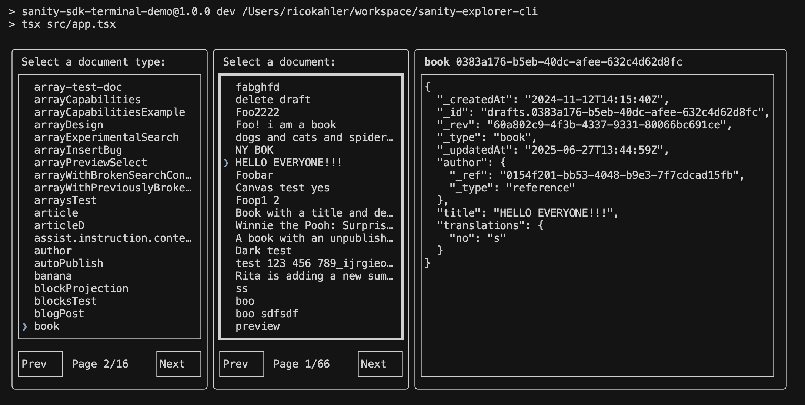

# Sanity SDK Terminal Demo

A terminal-based document explorer for Sanity CMS built with React and Ink. This demo showcases how to create interactive CLI applications using the Sanity SDK and React components.



[Video Demo!](https://youtu.be/aMNTPYq9CPY?si=5KKqEH2XHN2ejB4Q)

## 🎯 What is this?

This is a **demo project** that demonstrates how to build a terminal-based interface for exploring Sanity CMS documents. It features:

- **Document Type Selection**: Browse and select from available document types in your Sanity dataset
- **Document List**: View and navigate through documents of a selected type with pagination
- **Document Viewer**: Display full document content in a formatted JSON view
- **Interactive UI**: Navigate using arrow keys, enter, and space bar

## ⚠️ Important Notes

- **This is a demo/experiment** - not intended for production use
- **Repository is archived** - this is a proof-of-concept, not a maintained project
- **Limited error handling** - designed for demonstration purposes
- **Basic functionality** - focuses on core document exploration features

## 🚀 Quick Start

### Prerequisites

- Node.js 18+
- pnpm (recommended) or npm
- A Sanity project with a dataset

### Setup

1. **Clone the repository**

   ```bash
   git clone <your-repo-url>
   cd sanity-explorer-cli
   ```

2. **Install dependencies**

   ```bash
   pnpm install
   ```

3. **Configure environment**
   Copy the example environment file and update it with your values:

   ```bash
   cp .env.example .env
   ```

   Update the `.env` file with your Sanity project details:

   ```bash
   SANITY_STUDIO_PROJECT_ID=your_project_id_here
   SANITY_STUDIO_DATASET=your_dataset_name_here
   SANITY_TOKEN=your_sanity_token_here
   ```

   Generate the token in Sanity manage under your project.

4. **Run the application**
   ```bash
   pnpm dev
   ```

## 🎮 How to Use

Once running, you'll see a terminal interface with:

1. **Document Type Selection**: Use arrow keys to navigate, enter to select
2. **Document List**: Browse documents with pagination controls
3. **Document Viewer**: View full document content

### Controls

- **Arrow Keys**: Navigate between options
- **Enter**: Select current item
- **Ctrl+C**: Exit the application

## 🛠️ Technical Details

### Built With

- **[Ink](https://github.com/vadimdemedes/ink)**: React for CLI applications
- **[@sanity/sdk-react](https://www.sanity.io/docs/sdk-react)**: Sanity's React SDK
- **TypeScript**: For type safety
- **React**: Component-based architecture

### Architecture

- **Component-based**: Modular React components for each UI section
- **Suspense boundaries**: Proper loading states throughout the app
- **Pagination**: Efficient document loading with page-based navigation
- **Focus management**: Keyboard navigation between different sections

### Key Components

- `DocumentTypeList`: Lists available document types with pagination
- `DocumentList`: Shows documents of a selected type
- `DocumentViewer`: Displays full document content
- `PaneLayout`: Reusable layout component with header/footer support

## 🔧 Development

### Project Structure

```
src/
├── app.tsx              # Main application entry point
├── document-type-list.tsx
├── document-list.tsx
├── document-viewer.tsx
├── document-preview.tsx
├── pane-layout.tsx
├── select.tsx
├── button.tsx
├── truncated-text.tsx
└── constants.ts
```

### Available Scripts

- `pnpm dev`: Start the development server

## 🤝 Contributing

**Note**: This is a demo project that will be archived. While contributions aren't expected, feel free to fork and experiment with the code!

## 📝 License

MIT License - see [LICENSE](./LICENSE) file for details.

## 🙏 Acknowledgments

- [Sanity](https://sanity.io/) for the excellent SDK and documentation
- [Ink](https://github.com/vadimdemedes/ink) for making React in the terminal possible
- The React and TypeScript communities for the amazing tooling

---

**Remember**: This is a demonstration project showcasing the possibilities of building CLI applications with Sanity and React. It's not intended for production use is archived because I do not plan on maintaining this.
